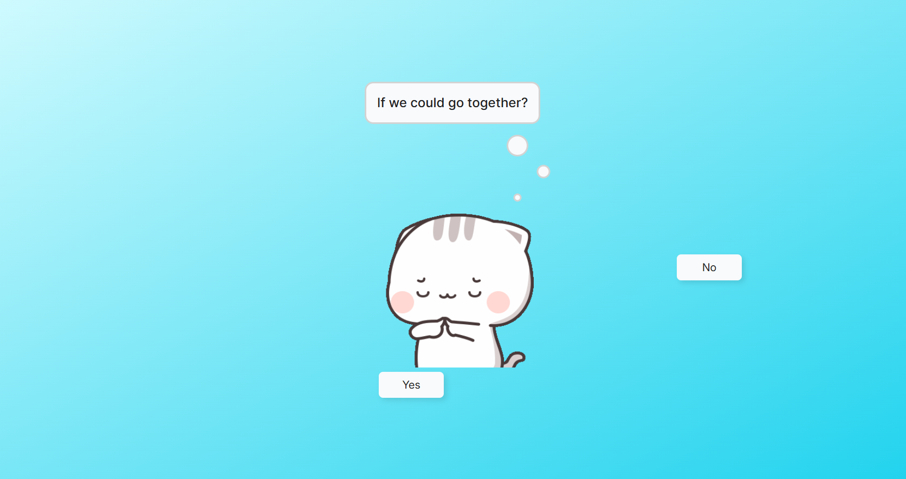
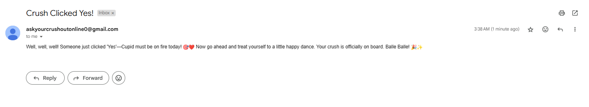
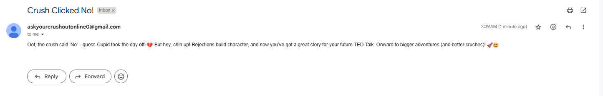

# 💌 Ask Your Crush Out Online!

**This Valentine's Day, take the leap!** Muster up your courage and ask your crush out—online! Who knows? Your crush might say **YES!** 😍 At the very least, you'll get a clear answer instead of daydreaming endlessly!

Spread the love and be a modern-day Cupid! Share this website with everyone and help them overcome their fears. You’re doing good work! ❤️

---

## 📖 About the Project

This project began as an experimental idea, but it quickly grew into a fully realized app aimed at making confessing feelings easier and more fun for everyone! 🎉 I initially followed tutorial by [Web Design Mastery](https://www.youtube.com/@webdesignmastery23) to create the basic structure of the website. However, as I worked through it, I realized that the process was too technical for someone without a computer science background to fully understand. The steps involved—such as downloading the code, making modifications without causing errors, setting up accounts on platforms like Netlify, and deploying the site—were complicated and could easily overwhelm non-technical users.

This insight led me to focus on simplifying the process and making the website accessible to a broader audience. I spent time refining the workflow, creating an easy-to-use interface, and ensuring that even users with no technical experience could use the website without needing to worry about the underlying code or deployment steps.

One of the most significant upgrades to this website was the addition of email notifications. Previously, users would have to manually check for a response from their crush, but now, when your crush responds with a "Yes" or "No," you'll receive an instant email notification, making the whole experience much more interactive and user-friendly. 🥳

Tutorial link: [Web Design Mastery's Tutorial](https://www.youtube.com/watch?v=hKx50WdhTlM&t=24s&pp=ygUPYXNrIG91dCB3ZWJzaXRl)

---

## 🌐 Try it out!

**Check out the live version of the website here:**

🔗 [https://iwaswondering.netlify.app](https://iwaswondering.netlify.app)

**Create a custom message:**

🔗 [https://iwaswondering.netlify.app/customize](https://iwaswondering.netlify.app/customize)

**Github Repository Link:**

🔗 [https://github.com/HrushikeshJoshi187/Ask_Your_Crush_Out_Online](https://github.com/HrushikeshJoshi187/Ask_Your_Crush_Out_Online)

🛠️ **Test the site before sending your message!**

---

## 🎥 Demo Video

Here’s a quick walkthrough of the website in action:

### Website


### Still Want To Go Out


---

## 📸 Screenshots

### Requirement Section


### Question Section


### Decision Section


### Most Fun Part



### Winning


### Victory Section


### Defeat Section


### Customize Section


### Crush Clicked Yes



### Crush Clicked No



---

## 🚀 Features

- **Customizable messages:** Write your own heartfelt (or hilarious) confession.
- **Real-time Notifications:** Get an **email notification** when your crush responds.
- **Secure & Private:** No unnecessary data collection—just your email to notify you.
- **Multi-language support:** Supports English, **Basic Latin**, and **Emojis**.
- **User-friendly:** Designed for **everyone**, even those with no tech experience.
- **Cheesy, but fun!** Because life’s too short to not shoot your shot. 💘

---

## 🛡️ Security Measures

We take security **very seriously**! 🔒

- **Sanitized Inputs** – Prevents XSS attacks with `dompurify`.
- **Security Headers** – `helmet` ensures safe HTTP headers.
- **Rate Limiting** – Protects against spam & DoS attacks.
- **HTTPS-Only** – Forces secure communication.
- **Email Queueing & Throttling** – Efficient email handling to avoid overload.

---

## 🏗️ Tech Stack

| Technology               | Purpose                          |
| ------------------------ | -------------------------------- |
| **Vite**                 | Fast frontend tooling            |
| **React**                | Frontend framework               |
| **TypeScript**           | Type safety & better development |
| **Node.js & Express**    | Backend server                   |
| **Dompurify**            | Input sanitization               |
| **Helmet**               | Security headers                 |
| **Express-Rate-Limiter** | Prevents abuse                   |
| **Nodemailer**           | Handles email notifications      |

---

## 📂 How to Run Locally

1. Clone this repository:

   ```bash
   git clone https://github.com/HrushikeshJoshi187/Ask_Your_Crush_Out_Online.git
   ```

2. Navigate to the project folder:

   ```bash
   cd Ask_Your_Crush_Out_Online
   ```

3. Navigate to the project folder:

   ```bash
   cd client
   ```

4. Install dependencies:

   ```bash
   npm install
   ```

5. Start the development server:

   ```bash
   npm run dev
   ```

6. Open new terminal & Navigate to the project folder:

   ```bash
   cd Ask_Your_Crush_Out_Online
   ```

7. Navigate to the project folder:

   ```bash
   cd server
   ```

8. Install dependencies:

   ```bash
   npm install
   ```

9. Add required Environment Variables.

10. Change the server link i.e. const serverURL = "https://ask-your-crush-out-online.onrender.com" in "buttons.tsx" (client) to const serverURL = "http://localhost:3000";

11. Change the frontend link i.e. origin: "https://iwaswondering.netlify.app" in "index.ts" (server) to origin: "http://localhost:5173"

12. Start the development server:

    ```bash
    npm run dev
    ```

Open your browser and navigate to http://localhost:5173 (default Vite localhost)

Your server will running on http://localhost:3000 (default server local host)

---

## 🎶 Soundtrack & GIFs

**Songs Used:** 🎵

- "Athletic - Yoshi's Island" (Super Mario World 2)
- "Jag Soona Soona Lage" (Om Shanti Om)

**GIFs Used:** 🖼️

- **Defeat:** [Peach Cat Crying](https://tenor.com/view/peach-cat-crying-man-cute-adorable-gif-16367785)
- **Losing:** [Mochi Cry](https://tenor.com/view/mochi-cry-sad-cat-gif-14105317)
- **Waiting:** [Peachcat](https://tenor.com/view/peachcat-cat-cats-kittens-kitties-gif-13806497)
- **Wondering:** [Erm...](https://tenor.com/view/erm-fingers-hmmm-cat-guilty-gif-16022705)
- **Victory:** [Elated Cat](https://tenor.com/view/elated-yay-bounce-cat-happy-gif-15647583)
- **Winning:** [Mochi Peach Cat](https://tenor.com/view/mochi-peach-cat-gif-18147022)

---

## 🌟 Contribute & Support

🎉 Acknowledgments
A huge shoutout to Web Desgin Mastery for their amazing tutorial.

If you love this project, feel free to:

✅ **Star** ⭐ this repo

✅ **Fork** 🍴 and contribute

✅ **Share** 📢 with friends & help them take their shot!

If you feel if it is too cheesy let me know! We can do something about it😂

💖 Let’s make Valentine’s Day special for everyone! 💖

Built with ❤️ by Hrushi Joshi
