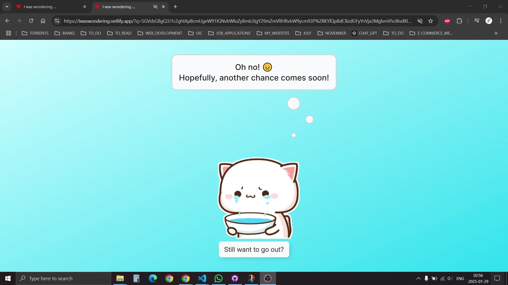
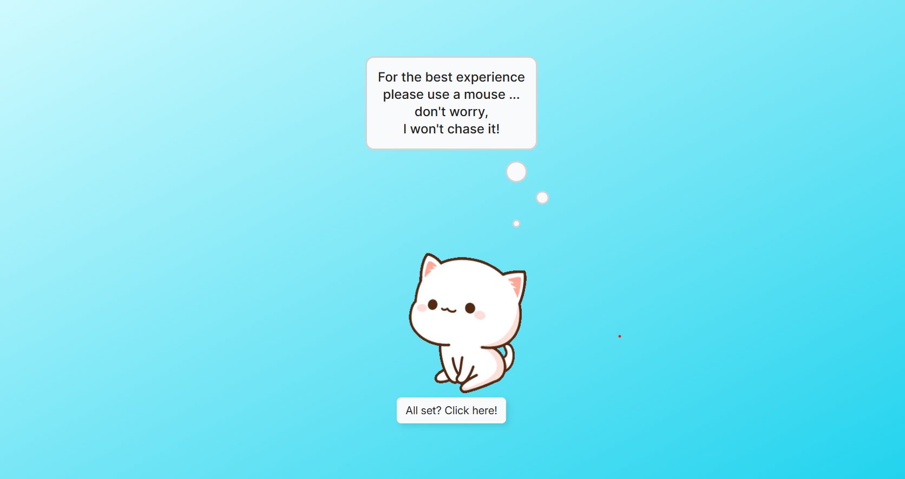
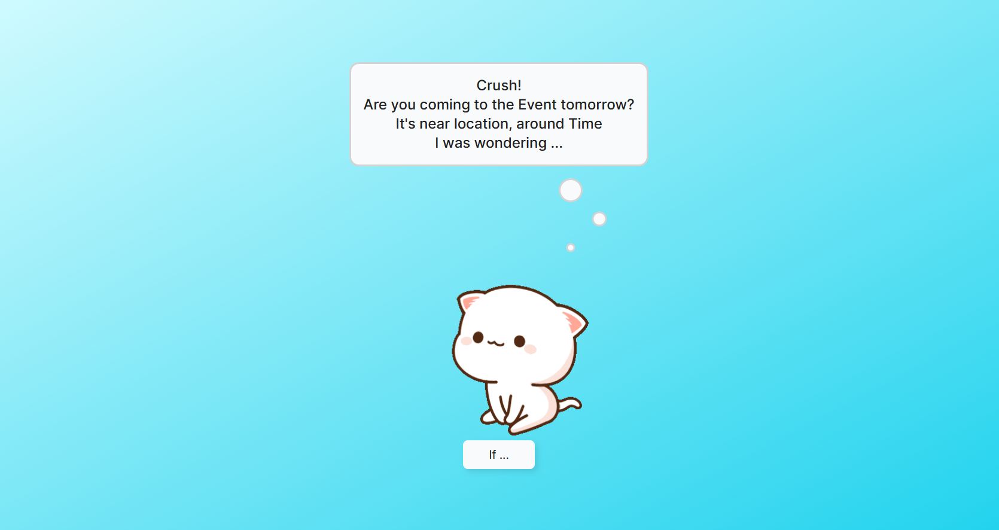
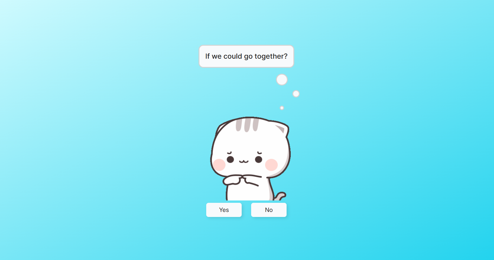
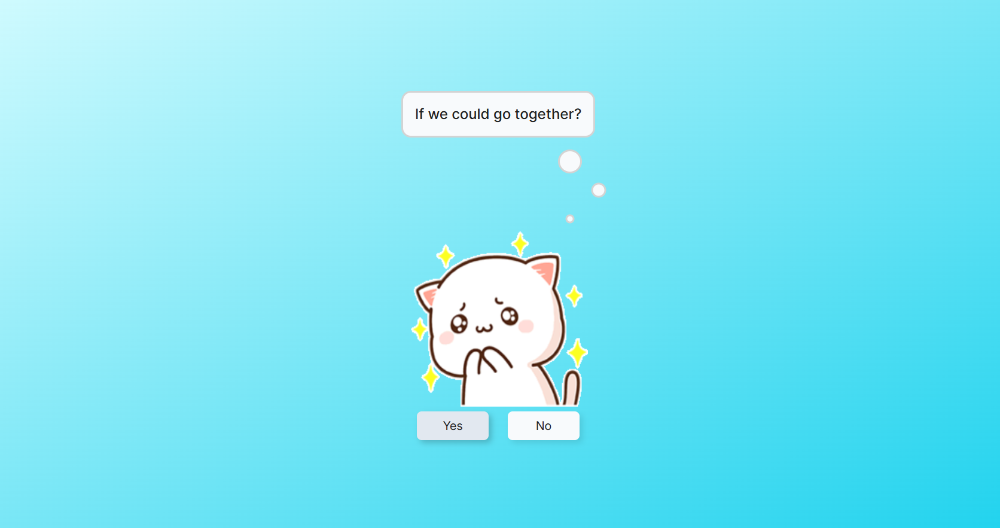
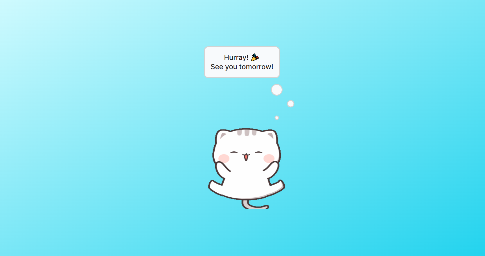
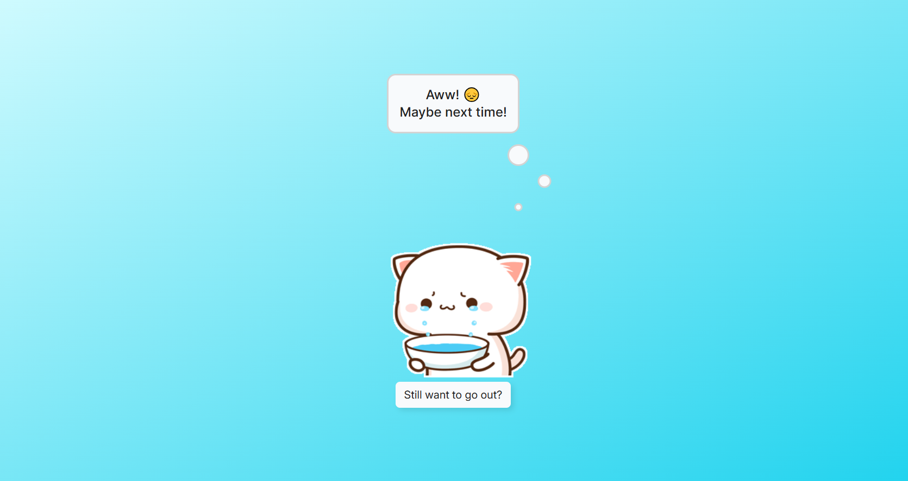
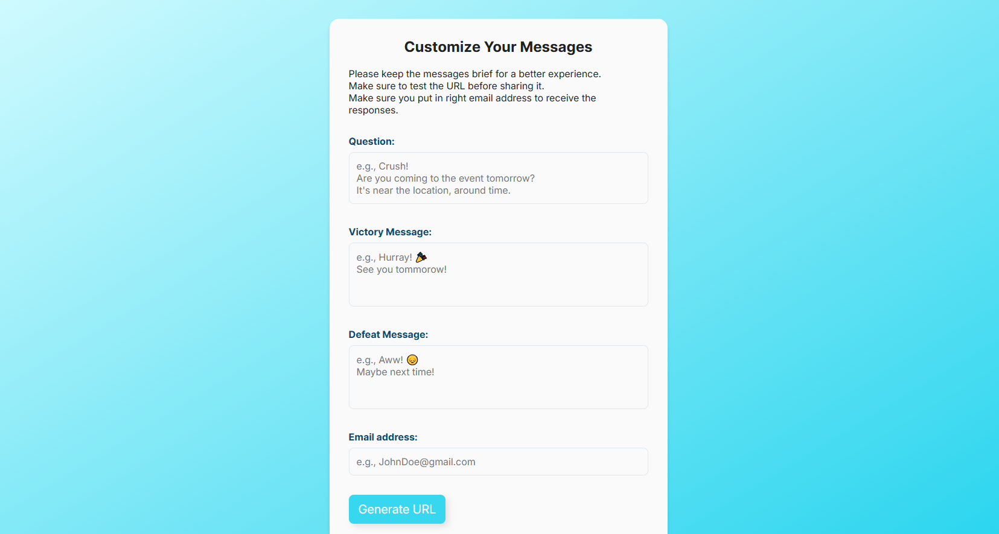

# 💌 Ask Your Crush Out Online!

**This Valentine's Day, take the leap!** Muster up your courage and ask your crush out—online! Who knows? Your crush might say **YES!** 😍 At the very least, you'll get a clear answer instead of daydreaming endlessly!

Spread the love and be a modern-day Cupid! Share this website with everyone and help them overcome their fears. You’re doing good work! ❤️

---

## 🌐 Try it out!

**Check out the live version of the website here:**  
🔗 [https://iwaswondering.netlify.app](https://johndoeportfoliowebsite.netlify.app)

**Create a custom message:**
🔗 [https://iwaswondering.netlify.app/customize](https://iwaswondering.netlify.app/customize)

🛠️ **Test the site before sending your message!**

---

## 🎥 Demo Video

Here’s a quick walkthrough of the website in action:

### Website


### Still Want To Go Out



---

## 📸 Screenshots

### Requirement Section



### Question Section



### Decision Section



### Fun


### Winning



### Victory Section



### Defeat Section



### Customize Section



---

## 🚀 Features

- **Customizable messages:** Write your own heartfelt (or hilarious) confession.
- **Real-time Notifications:** Get an **email notification** when your crush responds.
- **Secure & Private:** No unnecessary data collection—just your email to notify you.
- **Multi-language support:** Supports English, **Basic Latin**, and **Emojis**.
- **User-friendly:** Designed for **everyone**, even those with no tech experience.
- **Cheesy, but fun!** Because life’s too short to not shoot your shot. 💘

---

## 🛡️ Security Measures

We take security **very seriously**! 🔒

- **Sanitized Inputs** – Prevents XSS attacks with `dompurify`.
- **Security Headers** – `helmet` ensures safe HTTP headers.
- **Rate Limiting** – Protects against spam & DoS attacks.
- **HTTPS-Only** – Forces secure communication.
- **Email Queueing & Throttling** – Efficient email handling to avoid overload.

---

## 🏗️ Tech Stack

| Technology               | Purpose                          |
| ------------------------ | -------------------------------- |
| **Vite**                 | Fast frontend tooling            |
| **React**                | Frontend framework               |
| **TypeScript**           | Type safety & better development |
| **Node.js & Express**    | Backend server                   |
| **Dompurify**            | Input sanitization               |
| **Helmet**               | Security headers                 |
| **Express-Rate-Limiter** | Prevents abuse                   |
| **Nodemailer**           | Handles email notifications      |

---

## 📂 How to Run Locally

1. Clone this repository:

   ```bash
   git clone https://github.com/HrushikeshJoshi187/John_Doe_Portfolio_Website.git
   ```

2. Navigate to the project folder:

   ```bash
   cd John_Doe_Portfolio_Website
   ```

3. Install dependencies:

   ```bash
   npm install
   ```

4. Start the development server:

   ```bash
   npm run dev
   ```

Open your browser and navigate to http://localhost:5173 (default Vite localhost)

---

## 📖 About the Project

This project started as an experiment but evolved into a full-fledged app to make confessing feelings easier and **more fun**! 🎉

I followed **Web Design Mastery’s tutorial** ([YouTube Video](https://www.youtube.com/watch?v=hKx50WdhTlM&t=24s)), but I realized it was too technical for non-CS users. So, I spent time **simplifying the process** and making it **accessible** for everyone! 🚀

I followed Web Design Mastery's tutorial https://www.youtube.com/watch?v=hKx50WdhTlM&t=24s for the basic website. but I felt that It was almost impossible for a person from non CS background to download the code, edit it without messing it up, create account on and deloy it on netlify or any other platform. So I spent my making it accessible to all non-CS background peers. One major upgrade to this website is get email notfication after your crush yes/no on the website.

One major **upgrade**? **Email notifications** when your crush responds! 🥳

---

## 🎶 Soundtrack & GIFs

**Songs Used:** 🎵

- "Athletic - Yoshi's Island" (Super Mario World 2)
- "Jag Soona Soona Lage" (Om Shanti Om)

**GIFs Used:** 🖼️

- **Defeat:** [Peach Cat Crying](https://tenor.com/view/peach-cat-crying-man-cute-adorable-gif-16367785)
- **Losing:** [Mochi Cry](https://tenor.com/view/mochi-cry-sad-cat-gif-14105317)
- **Waiting:** [Peachcat](https://tenor.com/view/peachcat-cat-cats-kittens-kitties-gif-13806497)
- **Wondering:** [Erm...](https://tenor.com/view/erm-fingers-hmmm-cat-guilty-gif-16022705)
- **Victory:** [Elated Cat](https://tenor.com/view/elated-yay-bounce-cat-happy-gif-15647583)
- **Winning:** [Mochi Peach Cat](https://tenor.com/view/mochi-peach-cat-gif-18147022)

---

## 🌟 Contribute & Support

If you love this project, feel free to:
✅ **Star** ⭐ this repo
✅ **Fork** 🍴 and contribute
✅ **Share** 📢 with friends & help them take their shot!

If you feel if it is too cheesy let me know! We can do something about it😂

💖 Let’s make Valentine’s Day special for everyone! 💖

Built with ❤️ by Hrushi Joshi
